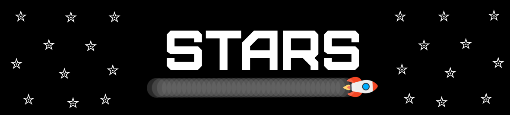

<div align="center">
    
    <h1></h1>
    <h3>Unicode stars for terminal interfaces</h3>
</div>


<p align="center">Stars was primarily a small program that I wrote to compose my setup a couple of months ago. It only took a few minutes to write it that day; however, I rewrote the source code to make it available on my Github.</p>

## Features
<ul>
    <li>Number of stars is generated based on terminal's dimensions</li>
    <li>Set a custom number of stars based on terminal's dimensions</li>
</ul>

## Table of contents
[Installing the Stars](#installing-the-stars)

- [Dependencies](#dependencies)

- [Downloading the source code](#dowloading-the-source-code)

- [Setting up Meson build system](#setting-up-meson-build-system)

- [Compiling the source code](#compiling-the-source-code)

- [Compiling the source code and installing the program in your system](#compiling-the-source-code-and-installing-the-program-in-your-system)

[Running the program](#running-the-program)

- [After compiling](#after-compiling)

- [After installing](#after-installing)

[Customization](#customization)

- [Number of stars](#number-of-stars)

- [Colors](#color)

# Installing the Stars
This section contains everything you need to know to compile and run the Stars.

## Dependencies
Stars requires the following dependencies to be linked with the executable.

<ul>
    <li>Ncurses</li>
    <li>Anemone</li>
</ul>

## Dowloading the source code
Copy/paste this git command on your terminal to download the source code

```sh
git clone --recursive https://github.com/Romulo-Moraes/Stars.git
```

## Setting up Meson build system
The process of setting up the build system is completely done by running the `build.sh` script on the project root. It will initialize the Meson Build system for the Stars and its dependencies.

<b>If you don't have the Meson on your system, you can get it from here: https://mesonbuild.com/Getting-meson_ptbr.html. Or from your package manager if available.</b>

## Compiling the source code
The Meson build handles the entire compilation process of the program. To compile the project, run the following command inside the `build/` directory: 
```sh
meson compile
```

## Compiling the source code and installing the program in your system
If you liked the application and want to make it available across your entire system, run:
```sh
# The Meson needs sudo permissions to install the app in your bin directory
sudo meson install
```

# Running the program

## After compiling
After compiling the project, the executable will be created in the build/ directory. Assuming that you have just compiled using the Meson build and still in the same directory, run:
```sh
./stars
```

## After installing
After installing the project, the Stars app will be available throughout your entire system. To launch the app, run:
```sh
stars
``` 

# Customization
This section will show you everything you need to know to customize the application.

## Number of stars
The number of stars is defined based on the terminal's dimensions. By default, a star is created for every 8 terminal cells. You can define how many cells are necessary to create a single star.

To customize the default value, you can pass any &#8469;<sup>*</sup> number using the `--proportionality` flag:
```sh
stars --proportionality 28
```

The program call above will instruct the Stars to create a new star for every 28 terminal cells.

Note: A single star is not limited by the range of a 28-cell block; it is simply a calculation to determine the maximum number of stars shown on the terminal.

## Color
The color of the stars is defined using the flag `--color` and accepts the following set of colors:
<ul>
   <li>black</li>
   <li>blue</li>
   <li>cyan</li>
   <li>green</li>
   <li>magenta</li>
   <li>red</li>
   <li>white</li>
   <li>yellow</li>
</ul>

```sh
stars --color yellow
```
Note: the default color is `white`